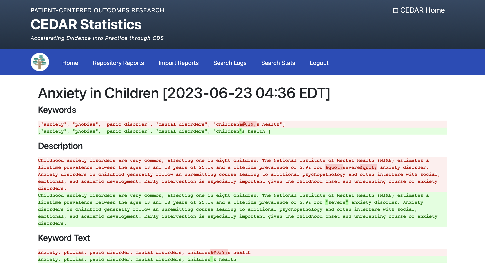

# CEDAR Administration Guide

This document provides a brief guide to using the CEDAR administration web application, henceforth referred to as CEDAR admin for brevity.

## Accessing CEDAR Admin

CEDAR admin is accessed using a web browser. Access requires users to authenticate using their AHRQ UMA credentials (CEDAR uses the same authentication and authorization mechanism as CDS Connect but it also require CEDAR administrators to be added to the `cedar-admin` group). Once authenticated, users will be presented with the CEDAR Statistics home page.

## Statistics

The statistics functions of CEDAR admin are read-only; authenticated users can browse the information presented without affecting users of the CEDAR application programming interface (API) or the CEDAR demonstration user interface (UI).

The screenshot below shows the top of the main CEDAR statistics page which is accessible using the "Home" button at the top of the page. Administrators can quickly scroll to different sections of the page using the "Jump to" links at the top.

## Reports

The reporting functions of CEDAR admin are read-only; authenticated users can generate and browse the information presented without affecting users of the CEDAR application programming interface (API) or the CEDAR demonstration user interface (UI).

The screenshot below shows a sample "Repository Reports" table. Note that missing descriptions and keywords may be the result of either:

- The metadata not being present in the source repository or API that CEDAR uses to index the repository, or
- There not being a reliable method for CEDAR to identify or extract that metadata

The screenshot below shows a sample "Search Logs" report. Each row represents a search executed on the CEDAR API. The black squares shown here are to redact the source of the search request, administrators can view the source without redaction. Older search logs can be viewed using the page navigation controls (1, 2, 3, ..., Next, Last) at the top of the list.

The screenshot below shows a sample "Search Stats" report. Administrators are able to customize the time period of the report and exclude particular search clients if desired (e.g. to hide searches coming from HHS and focus on external search clients). The black squares shown here are to redact the source of the search request, administrators can view the source without redaction.

## Managing Imports

Unlike the reports and statistics functions of CEDAR admin, import management functions can make changes to CEDAR content that is visible to end users. Additional care is required when using these functions as some actions cannot be undone without the support of a CEDAR developer.

### Reviewing Import History

Click the "Import Reports" tab at the top of the CEDAR Admin page to view a reverse-chronological list of all imports. The screenshot below show a sample screen.

Each row details an import from a particular repository and summarizes the time taken, the final status (e.g. success or failure), and statistics that show the total number of artifacts indexed, the number of artifacts that were new, updated, deleted, or generated errors or warnings. Details for a particular import can viewed by clicking the date and time stamp in the far left column.

Older imports can be viewed using the page navigation controls (1, 2, 3, ..., Next, Last) at the top of the list.

### Flagged Imports

When CEDAR detects that more than 10% of all artifacts in a given repository would be changed by an import:

1. The import is flagged for review
2. Any changes that would have been made by the import are held pending review
3. Further indexing of the repository is paused pending review

CEDAR will notify the administrator group by email when an import is flagged for review. CEDAR admin will also highlight any flagged imports on the "Home" and "Import Reports" tabs. The screenshot below shows an example where an Effective Health Care (EHC) import was flagged for review.

To review a flagged import, click on the date and time stamp in the left-most column of the table. CEDAR admin will show a list of all of the artifacts that would be changed by the import. The screenshot below shows an example.

Clicking the "changes" link will show which metadata fields would be changed and highlight the changes for easy review. The screenshot below shows and example of a changed artifact.

In the above, the red highlighted text shows the before state and the green highlighted text shows the after state. The darker shaded read and green highlight the actual changed text. In the above example, changes are related to quotes and apostrophes in the text and, in this case, are desirable changes.

The browser back button can be used to return to the list of artifacts that would changed by the import. Once the potential changes have been reviewed, an administrator can choose to either accept or reject the set of changes using the corresponding button at the top of the changed artifacts list. The screenshot below shows a final confirmation that is required.

Accepting the changes will:

1. Apply the changes
2. Re-enable the importer for the associated repository
3. Clear the flagged status for the import and set it to "reviewed"

Rejecting the changes will:

1. Retain the prior pre-import metadata for all artifacts
2. Re-enable the importer for the associated repository
3. Clear the flagged status for the import and set it to "reviewed"

Accepting or rejecting changes cannot be undone using CEDAR admin.

### Failed Imports

Imports will occasionally fail as indicated by a "failure" value in the import report table's status column. To review a failed import, click on the date and time stamp in the left-most column of the table. The screenshot below shows a sample failed import.

In general, an occasional failed import is not a cause for concern; transient internet issues or temporary issues with a repository cannot be eliminated in a distributed system like CEDAR. Consistent failed imports over several days should be investigated further, possible causes of consistent import failures include:

- The repository may be down for maintenance, scheduled maintenance times might overlap with the CEDAR import schedule
- Changes may have been made to the API that CEDAR uses to index the repository or to the repository web page format where CEDAR relies on HTML page scraping

