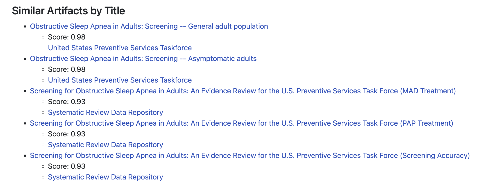
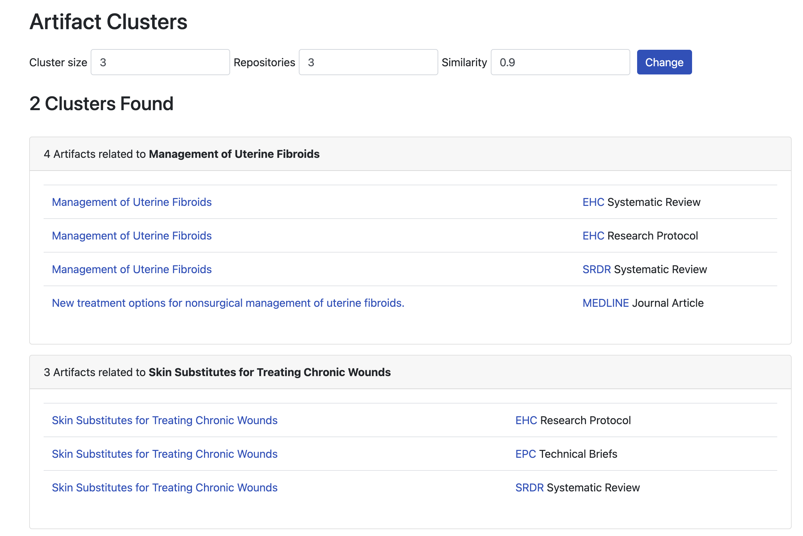

# Unmerged Branches

Two branches contain pilot or experimental work that was never deployed to production but may be
of interest for future development of CEDAR.

## FEvIR Importer

The CEDAR project conducted a pilot with [Computable Publishing](https://computablepublishing.com/)
exploring bi-directional data exchange between CEDAR and the [FEvIR Platform](https://fevir.net/).
The CEDAR importer supporting indexing of FEvIR content is available on the `fevir_importer` git
branch. This branch contains a CEDAR importer defined in `app/importers/fevir_importer.rb` that
pulls artifacts from a single FEvIR project currently specified in the `PROJECT_FOI` constant
defined in the importer code.

Using the FEvIR importer requires specifying the `FEVIR_API_BASE_URL` and a valid `FEVIR_API_TOKEN`
in the CEDAR Admin .env configuration file. Please contact Computable Publishing for the relevant
API information.

## Similarity Calculation

The CEDAR project explored the use of the
[Bidirectional Encoder Representations from Transformers (BERT)](https://arxiv.org/abs/1810.04805)
language model for calculating the similarity between pairs of artifacts and
[agglomerative hierarchical clustering](https://online.stat.psu.edu/stat555/node/86/)
to group CEDAR artifacts into similar clusters. Calculating the similarity between artifacts
supports functionality such as providing users with additional content related to their search
results. Clustering artifacts based on their similarity supports functionality such as determining
how AHRQ content is related across different repositories.

Support for similarity calculation and artifact clustering is available on the `similarity`
branch. Similarity calculation can be performed by running the `calculate_similarity` task:

```
rails utilities:calculate_similarity
```

This populates the CEDAR Admin database with the similarity calculation results. Similarity scores
can be viewed in the "Similar Artifacts by Title" section of individual artifact pages within CEDAR
Admin. For example (when running CEDAR Admin locally in development), see
[http://localhost:3000/artifact/2577].



Once similarity scores have been calculated, clusters of similar artifacts can be viewed on the
clusters page within CEDAR Admin. For example (when running CEDAR Admin locally in development), see
[http://localhost:3000/clusters].


